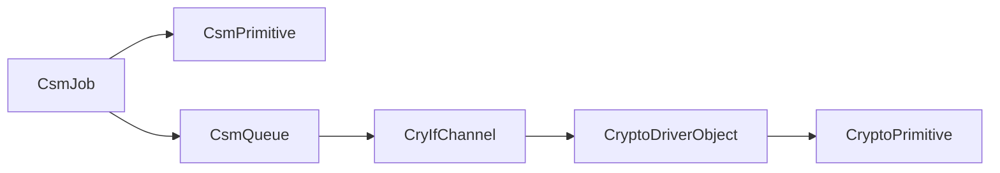

# DaVinci configuration guide: vKeyM_MPKA SecOC ECDH keys

## Purpose and recommended integration

This guide describes the DaVinci ECUC containers needed to configure a two-ECU ECDH negotiation and derive a SecOC MAC key with the checked-in RH850F1K security code.

Keep the CSM and CryIf ECUC definitions and their generated key-ID layer for vKeyM_MPKA. The vKeyM state machine calls CSM key-management APIs directly; it does not submit ECDH or KDF as CSM jobs. The checked-in `Crypto_30_CryWrapper` already implements `KeyExchangeCalcPubVal`, `KeyExchangeCalcSecret`, and `KeyDerive` by calling the mbedTLS-backed `SecLib_Ecc` routines. That gives the project a natural runtime route:

CSM jobs form a separate path for job-based SecOC MAC operations:

If CSM or CryIf are removed from the runtime, configuring their containers only creates references and generated identifiers; it does not redirect the CSM calls made by vKeyM. A replacement must provide a compatible implementation for the CSM key APIs used by vKeyM and preserve the generated key-ID and key-element-ID semantics. The lowest-risk fit to the code in this repository is to retain CSM/CryIf for vKeyM and use `Crypto_30_CryWrapper` as the custom Crypto backend.

The project directory contains the BSW module definitions and technical references but no configured DaVinci ECUC project ARXML. DaVinci generation and runtime behavior could not be checked on this PC. Treat the values below as the project-specific configuration baseline to enter and validate on the integration workstation.

## Scope and assumptions

- The ECU is RH850F1K and the selected curve is `secp224r1` / P-224. `code/security` currently implements P-224 only.
- Each vKeyM key-negotiation group has exactly two ECU members: this ECU and one remote ECU. The current Crypto wrapper does not implement the ECBD workflow for more than two participants.
- This is the SecOC message-group key use case, not the MacSec CAK/CKN use case.
- The checked-in SecOC compatibility adapter assumes message-group ID `2`. If the project uses another ID, update the adapter and its generated configuration together.
- The intended CS.00172 requirement set is the checked-in Change Level K. REQ 5.7.2 calls for the shared point `X || Y`, a one-byte message-group ID as `SharedInfo`, and X9.63/SHA-256. Confirm this is the ECU's approved requirement set before using these lengths.

## 1. Resolve two integration blockers first

### 1.1 Custom key-element IDs are not defined in this checkout

The vKeyM code uses these project-specific identifiers:

- `CRYPTO_KE_CUSTOM_KEYEXCHANGE_ECU_ID`
- `CRYPTO_KE_CUSTOM_KEYEXCHANGE_NUM_ECU`
- `CRYPTO_KE_CUSTOM_KEYEXCHANGE_PARTNER_PUB_KEY`
- `CRYPTO_KE_CUSTOM_KEYEXCHANGE_PARTNER_PUB_KEY_2`
- `CRYPTO_KE_CUSTOM_KEYEXCHANGE_INTERMEDIATE`

The checked-in `component/Csm/Implementation/Crypto_GeneralTypes.h` defines standard Crypto key-element IDs but does not define these custom IDs. DaVinci's numeric `CryptoKeyElementId` values and the C macros used by vKeyM and the Crypto driver must agree. Obtain the assigned values from the project/vendor integration, define them in the integration's Crypto general-types/custom header, and configure the same IDs in the Crypto key-element containers. Do not choose arbitrary values: the IDs must be unique in the project's key-element namespace and consistent across modules.

### 1.2 Initialize the ECC software backend before vKeyM uses it

The three Crypto wrapper ECC/KDF entry points fail closed unless `SecLib_EccIsInitialized()` is true. The checked-in code defines `SecLib_EccInit()`, but a repository-wide call-site search found no caller. `SecLib_Init()` initializes the ICUSE Cry driver; it does not initialize the ECC context. Add or confirm a startup call to `SecLib_EccInit()` after ICUSE/random initialization succeeds and before any vKeyM crypto state can run. The main function, trigger timing, and ECU startup ordering are integration choices; this PC cannot validate them.

## 2. Configure the Crypto module and key elements

Use the Crypto ECUC definition for `Crypto_30_CryWrapper` (the container paths in the checked-in BSWMD start with `/MICROSAR/Crypto_30_CryWrapper/Crypto`). Do not select the RH850 ICUSE Crypto driver as the ECDH implementation: the checked-in `Cry_30_Rh850Icus` driver reference lists AES-128, PRNG, CMAC, symmetric key extract, and symmetric key wrapping. The P-224 ECDH and X9.63 KDF functions are in software (`SecLib_Ecc`/mbedTLS); the existing ECC RNG bridge calls `SecLib_RandomGenerate`, which in turn uses `Cry_30_Rh850Icus_RngGenerate`.

In `CryptoKeyElements`, add the elements below. Use the standard symbolic IDs from the Crypto general-types header and the resolved project IDs for the custom elements. The sizes are bytes.

| Crypto key purpose | Key element ID | Size for this baseline | Notes |
|---|---|---:|---|
| Negotiation key | `CRYPTO_KE_KEYEXCHANGE_PRIVKEY` | 28 | Ephemeral P-224 private scalar, generated by the wrapper. Keep application read access denied where the driver/API allows it. |
| Negotiation key | `CRYPTO_KE_KEYEXCHANGE_OWNPUBKEY` | 56 | Public point, `X || Y`, big-endian. |
| Negotiation key | `CRYPTO_KE_KEYEXCHANGE_SHAREDVALUE` | 56 | Shared point `X || Y`, as required by the selected SecOC CS.00172 REQ 5.7.2. |
| Negotiation key | `CRYPTO_KE_KEYEXCHANGE_ALGORITHM` | 1 | vKeyM writes the selected protocol value here. |
| Negotiation key | `CRYPTO_KE_CUSTOM_KEYEXCHANGE_PARTNER_PUB_KEY` | 56 | Custom ECBD workflow element; vKeyM also clears this element. |
| Negotiation key | `CRYPTO_KE_CUSTOM_KEYEXCHANGE_PARTNER_PUB_KEY_2` | 56 | Custom ECBD workflow element; vKeyM also clears this element. |
| Negotiation key | `CRYPTO_KE_CUSTOM_KEYEXCHANGE_INTERMEDIATE` | 56 | Custom ECBD workflow element; vKeyM also clears this element. |
| Negotiation key | `CRYPTO_KE_CUSTOM_KEYEXCHANGE_NUM_ECU` | 1 | vKeyM writes the group member count. |
| Negotiation key | `CRYPTO_KE_CUSTOM_KEYEXCHANGE_ECU_ID` | 1 | vKeyM writes the local member position. |
| KDF input key | `CRYPTO_KE_KEYDERIVATION_PASSWORD` | 56 | vKeyM copies the shared value here before `Csm_KeyDerive`. |
| KDF input key | `CRYPTO_KE_KEYDERIVATION_SALT` | 1 | vKeyM writes the one-byte SecOC message-group ID. |
| Temporary message key | key element ID 1 / `CRYPTO_KE_MAC_KEY` | 16 | KDF output buffer; this key is temporary and unique to the message group. |
| Final message key | key element ID 1 / `CRYPTO_KE_MAC_KEY` | 16 | Committed SecOC MAC key; persist according to the approved key-storage design. |

For P-224, the wrapper expects a 56-byte peer public point and emits 56-byte `X || Y`; it does not expect the SEC1 `0x04` prefix. `Crypto_30_CryWrapper_Hw_KeyExchangeCalcSecret()` rejects an input length other than 56 bytes. The wrapper reads the `PRIVKEY`, writes the `SHAREDVALUE`, and reads KDF `PASSWORD` and `SALT`; the vKeyM state machine also writes and clears the other listed elements. Check element write/access settings against those calls. If an element is larger than the bytes vKeyM writes, enable partial access where supported; exact-sized elements avoid that extra dependency.

Create a `CryptoKeyType` for the negotiation key. The Vector vKeyM reference calls out `KeyExchange_NISTP224R1_BD` as the Vector-stack template, with the key elements in its ECBD key-element tables. The current `Crypto_30_CryWrapper` preconfiguration does not contain a ready-made MPKA key type, so create the needed `CryptoKeyType` and element references in the active DaVinci project or import the compatible project template. Although the key type contains the ECBD bookkeeping elements, the checked-in backend supports only the two-ECU ECDH path; do not configure a group that can reach ECBD.

Create distinct `CryptoKeyType`s as required by the active driver's type model for the KDF input key and MAC keys. The temporary and final SecOC keys must be the same key type, and the target key's element with ID 1 must have exactly 16 bytes for this integration. The KDF input may be reused across message groups, but the negotiation key, temporary key, and final key must not be accidentally aliased.

Create four distinct `CryptoKey` instances for this group/message group:

1. Negotiation key (one per key-negotiation group; the Vector reference says it must not be reused across groups and must be persistent).
2. KDF input key (`PASSWORD` and `SALT`; persistence is not required by the vKeyM reference).
3. Temporary SecOC message key (one per message group).
4. Final SecOC message key (one per message group; persisted).

For each `CryptoKey`, set a unique `CryptoKeyId`, reference its matching `CryptoKeyType`, and configure each `CryptoKeyElement`'s initial value, partial-access, persistence, read access, and write access deliberately. vKeyM cannot provision the initial shared-secret/default state itself; the technical reference assigns that provisioning to integration. Use only an approved initial/default value and do not put production private or MAC key material into generated ARXML. Reconcile the Vector persistence requirement for the negotiation key with the software backend: the checked-in ECC notes say the ephemeral private scalar is held in software RAM and is not an ICUSE/SHE slot. Confirm persistence granularity, reset behavior, and the resulting assurance boundary with the platform owner before enabling NVM persistence for that scalar.

Configure a `CryptoDriverObject` for `Crypto_30_CryWrapper` and include the Crypto primitives required for job-based services such as SecOC MAC generation/verification. The ECDH and KDF operations used by vKeyM are direct Crypto key-management APIs; do not invent CSM ECDH job references for vKeyM. Ensure the wrapper APIs and custom `Hw` functions are included in the build configuration used by DaVinci.

## 3. Configure CryIf

In `/MICROSAR/CryIf`:

1. Under `CryIfKeys`, add one `CryIfKey` for each Crypto key from Step 2. Set its `CryIfKeyId` uniquely, and set `CryIfKeyRef` to the matching `/MICROSAR/Crypto_30_CryWrapper/Crypto/CryptoKeys/CryptoKey`.
2. Under `CryIfChannels`, add the channel used for CSM job dispatch. Set a unique `CryIfChannelId` and its `CryIfDriverObjectRef` to the `CryptoDriverObject` configured for `Crypto_30_CryWrapper`.
3. In `CryIfCryptoModule`, reference the active `Crypto_30_CryWrapper` module and enable the module/API capabilities needed by the actual integration package.

The key reference needed by vKeyM travels through `CsmKey -> CryIfKey -> CryptoKey`. The channel is a different reference: CSM queues use it to route jobs to a driver object. Do not substitute a channel reference for a CryIf key reference.

## 4. Configure CSM

In `/AUTOSAR/EcucDefs/Csm` (or the matching DaVinci CSM module instance):

1. Under `CsmKeys`, create one `CsmKey` for every CryIf key above.
2. Set each `CsmKey`'s `CsmKeyRef` to its matching `CryIfKey`.
3. Give keys clear, stable symbolic names, for example `CsmKey_MPKA_Group0`, `CsmKey_MPKA_Kdf_Group0_Msg2`, `CsmKey_MPKA_Tmp_Group0_Msg2`, and `CsmKey_MPKA_Final_Group0_Msg2`.
4. Keep generated CSM key identifiers unique. In code, use the generated symbolic handles such as `CsmConf_CsmKey_<name>`; do not copy numeric key IDs from a different DaVinci generation.
5. Verify that the generated CSM provides the key-management functions used by vKeyM: `Csm_KeyExchangeCalcPubVal`, `Csm_KeyExchangeCalcSecret`, `Csm_KeyDerive`, `Csm_KeyElementCopy`, `Csm_KeyElementSet`, and `Csm_KeySetValid` (and `Csm_KeyElementGet` if using the current SecOC adapter).

The exact vKeyM references are to `CsmKey` containers; vKeyM does not reference a `CsmJob` for its ECDH/KDF flow. `CsmJobs`, `CsmPrimitives`, `CsmQueues`, and `CsmMainFunction` are needed only for job-based consumers, including the chosen SecOC MAC path.

### Optional: CSM MAC jobs for SecOC

If the deployed SecOC authenticator uses CSM MAC jobs, configure separate `CsmJob` entries for MAC generation and verification, each pointing to the correct `CsmPrimitive` and queue. Configure the queue's `CsmChannelRef` to the CryIf channel, then configure the Crypto driver object's matching `CryptoPrimitive` entries for the MAC implementation. The key used by those jobs must match the selected backend:

- For a standard job-to-key route, point the job at the committed final message-group key and keep plaintext key export disabled if the primitive can consume it internally.
- The checked-in `SecOcSecurityLib` compatibility adapter instead reads final key element 1 with `Csm_KeyElementGet`, copies it to ICUSE `KEY_RAM`, and performs its MAC calls with `KEY_RAM`. That route requires the final key's read access to allow the export and a project-specific CSM dispatch hook. It is not an opaque hardware-key route. The adapter is bound to message-group ID 2 and the checked-in SecOC profile lengths (7 authenticated bytes and a 3-byte transmitted MAC); confirm they match the actual SecOC configuration before selecting it.

Do not assume that `CsmJobKeyRef` alone makes the compatibility adapter consume the final vKeyM key: the adapter explicitly loads the key into `KEY_RAM`. Keep generated job IDs, the dispatch hook, activation callback, and the actual MAC key path aligned.

## 5. Configure vKeyM_MPKA

Under `/MICROSAR/vKeyM_MPKA/Cdd/CddKeyNegotiationGroup`, create the SecOC key-negotiation group and configure:

| vKeyM parameter | Setting for this integration |
|---|---|
| `CddKeyNegotiationGroupId` | Unique SecOC ID in `0..127`. |
| `CddKeyNegotiationType` | SecOC. |
| `CddKeyNegotiationCurve` | `VKEYM_MPKA_CURVEID_SECP224`. This is the only curve implemented in the checked-in SecurityLib ECC backend. |
| `CddKeyNegotiationSharedValueLengthType` | `VKEYM_MPKA_SHARED_VALUE_LENGTH_X_AND_Y` for Change Level K SecOC. |
| `CddKeyNegotiationGroupKeyRef` | Symbolic reference to the CSM negotiation key from Step 4. |
| `CddKeyNegotiationGroupMembers` | Exactly one remote member, plus this local ECU, for a two-ECU ECDH group. |

Configure the local/remote member IDs, Tx/Rx PDU references, timers, PduR routing, and optional DEM references according to the vehicle network and the module's other integration requirements. Keep the same curve, member topology, group IDs, and message-group ID on both ECUs.

Under the group's `CddMessageGroup`, create one message group and set:

| vKeyM parameter | Setting |
|---|---|
| `CddMsgGrpId` | The unique SecOC message-group ID. Use `2` while the checked-in SecurityLib adapter remains hard-coded to ID 2. |
| `CddMsgGrpKDFInputKey` | Reference the KDF input CSM key. |
| `CddMsgGrpTmpKey` | Reference the temporary message-key CSM key. |
| `CddMsgGrpKey` | Reference the final message-key CSM key. |
| `CddMsgGrpTmpKeyMacSec` | Leave empty for SecOC. |

For Change Level K SecOC, configure `CRYPTO_KE_KEYEXCHANGE_SHAREDVALUE` and `CRYPTO_KE_KEYDERIVATION_PASSWORD` to 56 bytes for P-224, with `CRYPTO_KE_KEYDERIVATION_SALT` at 1 byte. The group’s `X_AND_Y` setting and the KDF password length must agree. The KDF salt value is written by vKeyM as the message-group ID, so a mismatch between ECU configurations produces different MAC keys.

## 6. RH850F1K and security-boundary notes

The current architecture uses mbedTLS for P-224 scalar multiplication, peer-point validation, ECDH, and X9.63/SHA-256. ICUSE is used by the existing SecurityLib path for random generation and AES/CMAC/SHE operations, not for this ECC calculation. The ECC code stores the ephemeral scalar in software key-element storage and local working memory; it does not place that scalar in an ICUSE/SHE hardware key slot. The checked-in ECC header itself labels this a software interpretation of the HPSE storage requirement and says the assurance deviation must be recorded. Treat that as a platform/security review item, not as a property solved by DaVinci configuration.

The `Crypto_30_CryWrapper` ECDH function accepts one 56-byte peer point. vKeyM can select ECBD for larger groups or based on runtime membership. Keep the configured group to two ECUs and ensure runtime topology cannot select ECBD; otherwise implement and validate the ECBD workflow in the Crypto backend before using that group.

## 7. DaVinci review checklist for the integration workstation

Before accepting generated output, confirm:

- Every vKeyM `...KeyRef` resolves to a `CsmKey`, every `CsmKeyRef` resolves to the intended `CryIfKey`, and every `CryIfKeyRef` resolves to the intended `CryptoKey`.
- The custom five key-element IDs are defined in the build's Crypto general-types/custom header and equal the configured `CryptoKeyElementId` values.
- The negotiation key contains the P-224 elements and 56-byte shared-value storage; KDF password is 56 bytes; SecOC salt is one byte; temporary/final key element 1 is 16 bytes.
- The key IDs do not alias across logical keys; the final key is unique per message group and persistence matches the approved storage design.
- Only two group members can participate in this ECDH-only backend.
- The CSM key-management APIs resolve to the `Crypto_30_CryWrapper` implementation, and `SecLib_EccInit()` runs after `SecLib_Init()` and before negotiation.
- If the SecurityLib MAC adapter is selected, the final key is readable only as deliberately approved, the activation callback loads ID 2 into `KEY_RAM`, the CSM dispatch hook uses the generated job IDs, and no other operation races for `KEY_RAM`.
- Both ECUs use identical curve, shared-value encoding, KDF sizes, and IDs.

DaVinci reference validation and generation, integration compilation, and two-ECU runtime checks remain to be performed on the configured engineering workstation/target. This PC has neither DaVinci Configurator nor the project toolchain, so this guide does not claim generated-code or target validation.

## Sources in this project

- [Vector vKeyM_MPKA Technical Reference](../component/vKeyM_MPKA/Documentation/TechnicalReference_vKeyM_MPKA.pdf), §§3.11, 4.4, 5.3–5.7.1, pp. 14, 23, 25–30; [vKeyM BSWMD](../component/vKeyM_MPKA/BSWMD/vKeyM_MPKA_bswmd.arxml), especially `CddKeyNegotiationGroupKeyRef` and message-group references.
- [AUTOSAR CS.00172 Change Level K](../standards/CS_00172.pdf), §§5.6–5.7, pp. 17–20.
- [CSM BSWMD](../component/Csm/BSWMD/Csm_bswmd.arxml) and [CSM Technical Reference](../component/Csm/Documentation/TechnicalReference_Csm.pdf), CSM keys, `CsmKeyRef`, and key-management APIs.
- [CryIf BSWMD](../component/CryIf/BSWMD/CryIf_bswmd.arxml) and [CryIf Technical Reference](../component/CryIf/Documentation/TechnicalReference_CryIf.pdf), CryIf key and channel references.
- [Crypto_30_CryWrapper BSWMD](../component/Crypto_30_CryWrapper/BSWMD/Crypto_30_CryWrapper_bswmd.arxml), [Crypto_30_CryWrapper ECC/KDF implementation](../component/Crypto_30_CryWrapper/Implementation/Crypto_30_CryWrapper_Hw.c), and [SecurityLib ECC interface](../code/security/include/crypto_lib/seclib_ecc.h).
- [SecurityLib ECC implementation](../code/security/source/crypto_lib/seclib_ecc.c), [SecurityLib initialization and RNG](../code/security/source/crypto_lib/crypto_library.c), and [SecOC SecurityLib CSM adapter](../code/security/source/crypto_lib/secoc_securitylib_csm_wrapper.c).
- [Cry_30_Rh850Icus Technical Reference](../component/Cry_30_Rh850Icus/Documentation/TechnicalReference_Cry_30_Rh850Icus.pdf), §6.4.1, supported cryptographic services.
